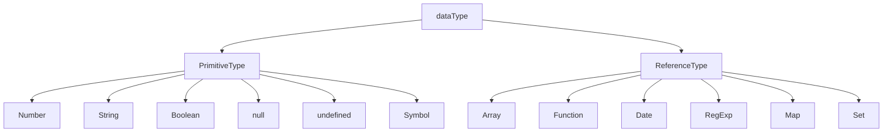

## 코어 자바스크립트

## 1. 자료형




- 기본적으로 기본형은 **불변성** 참조형은 **가변성** (내부 프로퍼티를 변경할 때에만 , 참조형 데이터 자체를 변경할 경우 불변성)

- 변수 선언 시 : 해당 변수명 (식별자) 를 변수 영역 메모리에 할당

- 변수값 할당 시 : 해당 값을 데이터 영역 메모리에 할당

  Ex)

```javascript
const a = 100;

const obj = {
  x : 100,
  y : 'abc',
};
```


### 1-1. 기본형이 불변성인 이유

```javascript
const a = 100; // -- 1 (예제와 같은 상태)
a = 200;			 // -- 2
a = 300;			 // -- 3
```

​		- 2


​		- 3


@2001, @2002 메모리 주소에 할당 된 값은 변하지 않으므로 불변성 ( 가비지 컬렉션으로 제거 )


### 1-2. 참조형이 가변성인 이유 (객체 내부 프로퍼티를 변경할 때)

```javascript
const obj = {    // -- 1
  x : 100,
  y : 'abc',
};

obj.x = 200;		 // -- 2
```

​		-- 1


​		-- 2


obj1 이 바라보고 있는 메모리 주소인 @2001 의 값은 변하지 않았지만 기존의 객체 내부의 값만 바뀜.

### 1-3. 불변객체를 만드는 방법 (새로운 객체를 할당)

```javascript
const obj = {
  x: 100,
  y: 'abc',
};

obj = {
  x: 200,
  y: 'def',
};
```

얕은 복사가 아닌 깊은 복사를 통해 참조값 주소를 복사하지 않고 깊은복사를 통하여 새로운 값으로 할당하는 것이 중요.

얕은 복사를 통해 참조값을 복사하여 내부 프로퍼티를 수정하게 되면, 원본과 사본 둘 중 하나만 값의 변경이 일어나도 모두에게 적용됨. 